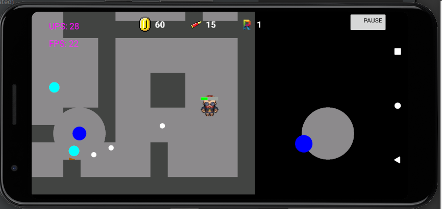

<h1 align="center">ZombieLayer</h1>

  

# Intro
it is a small game where you should stay alive

## controls

there are 2 joypad that let u play :
* left: move
* right: shoot

zombie are simply a light-blue circle that try to catch you using an implementation of *djstra*.

## interface

In the upper side of screen you have:

* __coin:__ are useful to open door to get on over the map
* __bullets:__ is the amout of bullet, once you end it u need a few of second to recharge
* __round:__ is your current round, every time the count go up enemy become stronger

# About
in the left side you have the pause button that cam be pressed in any time, the game is currently feature poor, but it will be replaced by a new version

# Requirements
* Andoid Studio

